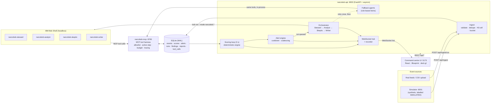

# Architecture

## System Architecture

Two speeds: a deterministic **fast path** scores every cell every 2 seconds; a **slow path**
runs four IBM Bob agents only when an alert fires. The agents never touch the database or
the file system directly. They act only through the MCP tool harness.

## Components

| Component | Technology | Responsibility |
|---|---|---|
| Simulator (`narcobob/simulator`) | Python, NumPy, FastAPI | Seeded synthetic events: urban-centre mixture, enforcement field around police stations, surges / outages / raids; backfill then live stream; control API |
| API (`narcobob/api`) | FastAPI, asyncio | Ingest, scoring loop, alert engine, REST read models, WebSocket hub, JSONL recorder, simulator proxy |
| Engine (`narcobob/engine`) | NumPy, h3 v4 (pure functions, `mypy --strict`) | Cell universe, smoothing, acceleration, divergence, spillover, Getis-Ord Gi\*, robust z, composite score, severity, Dirichlet sensitivity, data-quality checks |
| Tool harness (`narcobob/harness`) | Official MCP Python SDK (FastMCP, streamable HTTP) | 10 tools; per-agent allowlist; active-step authorisation; 40-call budget; 32 KB response cap; idempotent submits; every call traced to `tool_calls`; evidence recomputed as of each alert |
| Agents (`src/agents/`) | **IBM Bob Shell** custom modes | `custom_modes.yaml` (4 modes, MCP tool group only), per-mode rules, shared `AGENTS.md`, `mcp.json`. Every Bob touchpoint: [ibm-bob-usage.md](ibm-bob-usage.md) |
| Orchestrator (`narcobob/orchestrator`) | asyncio subprocesses | Deterministic state machine; runs `bob run --mode …` headless (argument list, no shell); verifies output; retry; fallback; applies verdicts; streams agent activity |
| Fallback agents | Python + Jinja2 | Rule-based Steward/Analyst/Skeptic/Writer using the same tools; schema-identical outputs |
| Storage | SQLite, WAL mode | Single file; the agents' shared blackboard |
| UI (`src/frontend`) | React 19, Blueprint.js, dockview, deck.gl H3HexagonLayer, MapLibre, Zustand, Recharts | Dockable command view (live map, alert feed, cell detail, agent swim-lanes, brief, event ticker) and an Observability view (runs, agent log of every step / tool call / finding, Bob console via `GET /api/runs/{id}/log`); on-screen help |
| Replay (`narcobob/replay`) | FastAPI | Serves a recorded real session over the same interface (demo insurance) |
| Backtest (`narcobob/backtest`) | NumPy | Offline scenario runs, detection/decoy/false-alarm metrics, naive baselines |

## Data Flow (one alert, end to end)

1. The simulator POSTs a batch of events; ingest validates each (schema, bounding box),
   drops duplicates by `event_id`, assigns an H3 cell and a day bucket, and bumps
   `data_version`.
2. The scoring loop sees a new version, rebuilds the last 60 complete days as a count
   array, and scores all cells (≈ 8 ms for the 916-cell demo area; < 200 ms for 3,400 cells in the test
   suite). Changed cells are upserted and broadcast as `scores.update`.
3. A cell entering HIGH/CRITICAL becomes an `alert.raised`. After 15 s the pending alerts
   become one queued run (`run.queued`); the worker picks the most severe run first and
   reviews its six most severe cells.
4. For each agent the worker inserts a `running` step. That row is what authorises the
   agent's tool calls. It then runs Bob Shell headless:
   `bob run --mode narcobob-skeptic -w src/agents --trust --accept-license "RUN_ID=… STEP_ID=…"`.
5. The agent calls MCP tools (`get_support`, `run_sensitivity`, …). The harness checks the
   allowlist and the active step, enforces the budget, recomputes evidence as of the
   alert, and traces the call. The API streams those traces as `agent.tool_call`.
6. The agent finishes with `submit_findings` / `submit_report` (validated: a report without
   both enforcement and treatment actions is rejected). No output → retry once →
   fallback twin. After the Skeptic, verdicts become each alert's final severity
   (`alert.updated`); after the Writer, `report.ready`.

## Security and Safety Notes

- **Least privilege for agents.** Bob modes get only the `mcp` tool group: no file edits,
  no shell. The harness independently enforces a per-agent tool allowlist, e.g. only the
  Writer can submit a report, and only the Skeptic can run sensitivity analysis.
- **No authority outside a live step.** A tool call is accepted only for a
  `(run, step, agent)` the orchestrator marked running; replayed or forged ids get
  `STEP_NOT_ACTIVE`.
- **Bounded agents.** 40 tool calls per step, 32 KB per response, a per-step timeout, a
  `--max-turns` cap, no subagents.
- **No parsing of model output.** Results enter only through validated tool calls;
  stdout is kept as a debugging log.
- **No personal data.** Events are place-and-time only. The system predicts places,
  never people.
- **Secrets.** The Bob API key lives only in the gitignored `src/.env` and reaches Bob
  through the child process environment.
- **Local only.** All services bind to `127.0.0.1`; there is no authentication, which is
  a known limitation for anything beyond a single-machine deployment.

## Scalability Notes

The design target is one district on one machine. SQLite in WAL mode with short
transactions comfortably handles the demo's ~100 events per simulated day at 1 day / 3 s.
The engine is vectorised and scores thousands of cells in well under a second. Bob reviews
are the bottleneck (minutes per run), which is why alerts are coalesced, prioritised by
severity and capped at six cells per run. The WebSocket only carries cells the map can show.
